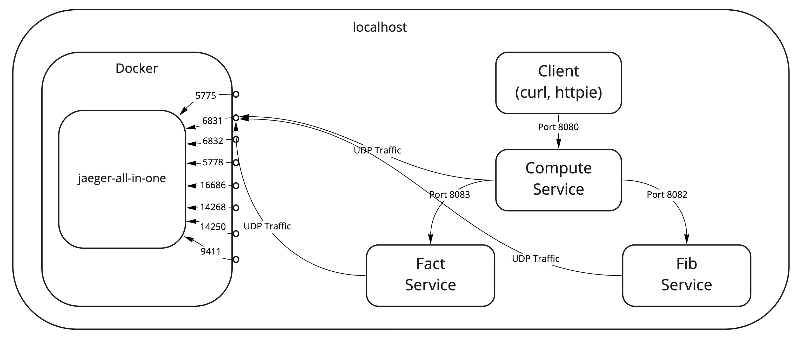
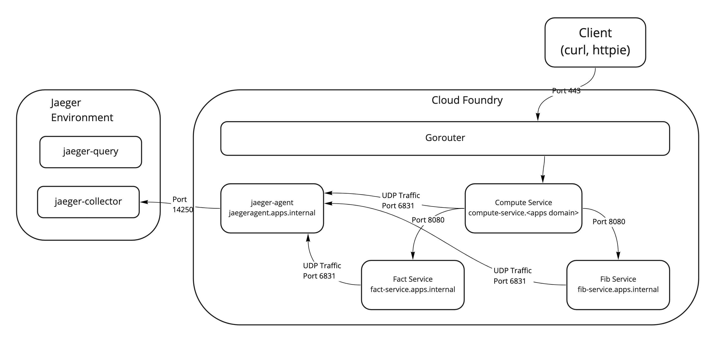

# jaeger-tracing-sample for Cloud Foundry
This app is a sample app for demonstrating how to use the jaeger-agent as a Cloud Foundry deployed app and how to use 
that agent from a set of SpringBoot apps.

# Sources
The microservices in here are not original -- they are derivatives of what was shared in 
[this blog post](http://www.vinsguru.com/spring-boot-distributed-tracing-with-jaeger/).  I simply modified the 
microservices for Cloud Foundry deployment instead of docker-compose.

The Jaeger run commands in this sample come from the official [Jaeger docs](https://www.jaegertracing.io/), and are 
using version 1.18.

# Test locally

## Architecture Overview



## Run a local Jaeger

Using docker, run the all-in-one Jaeger setup locally.

```bash
$ docker run -d --name jaeger \
  -e COLLECTOR_ZIPKIN_HTTP_PORT=9411 \
  -p 5775:5775/udp \
  -p 6831:6831/udp \
  -p 6832:6832/udp \
  -p 5778:5778 \
  -p 16686:16686 \
  -p 14268:14268 \
  -p 14250:14250 \
  -p 9411:9411 \
  jaegertracing/all-in-one:1.18
```

## Run each app

```bash
# change to correct directory if not already there
$ cd jaeger-tracing-sample
# build the microservices
$ mvn clean install
# In each of the directories compute-service, fib-service, and fact-service
$ mvn spring-boot:run

```

## Test app by generating some traffic

```bash
$ for i in 1 2 3 4 5 6 7 8 9 10 11 12; do curl -k http://localhost:8080/api/compute/fib/$i; done
$ for i in 1 2 3 4 5 6 7 8 9 10 11 12; do curl -k http://localhost:8080/api/compute/fact/$i; done
```

## Check the Jaeger GUI to see your results

* Open http://localhost:16686/ in your browser
* Select `compute-service` from the `Service` dropdown in the top left
* Click `Find Traces` button 
* You should be able to drill into several traces in the UI

## Clean up your local workspace

* Stop the running local microservices
* `docker kill` the `jaeger` container

# Run on Cloud Foundry

## Architecture Overview



## Run Jaeger somewhere on your infrastructure

This is beyond the scope of this example.  You can refer to the official [Jaeger docs](https://www.jaegertracing.io/) f
or options.  Take note where the `jaeger-collector` runs -- you'll need this hostname/IP and port number later.
 
## Modify this sample to point to your  Jaeger collector

In the previous step you noted where the `jaeger-collector` runs.  Open jaeger-agent-app-cf/manifest.yml file and in 
line 10, put the correct address and port number for the jaeger collector for your environment.  This address
and port number should be the value for the `--reporter.grpc.host-port` command line argument.  

## Build and cf push all apps to Cloud Foundry

Build and push all apps.

```bash
$ cd jaeger-agent-app-cf; cf push; cd ..; mvn clean install; cd compute-service; cf push; cd ..; cd fib-service; cf push; cd ..; cd fact-service; cf push; cd ..
```

Since we are using container networking, we'll need to add the correct policies so our microservices can speak to each 
other across the container network.

```bash
$ cf add-network-policy compute-service --destination-app fib-service --protocol tcp --port 8080; cf add-network-policy compute-service --destination-app fact-service --protocol tcp --port 8080; cf add-network-policy compute-service --destination-app jaeger-agent --protocol udp --port 6831; cf add-network-policy fib-service --destination-app jaeger-agent --protocol udp --port 6831; cf add-network-policy fact-service --destination-app jaeger-agent --protocol udp --port 6831 
```

> Take note of the Cloud Foundry route assigned to the `compute-service` app.  You'll want to know this for the curl 
commands you are going to use for the testing in the next step.
 
## Test app by generating some traffic

```bash
$ for i in 1 2 3 4 5 6 7 8 9 10 11 12; do curl -k https://<route for compute-service here>/api/compute/fib/$i; done
$ for i in 1 2 3 4 5 6 7 8 9 10 11 12; do curl -k https://<route for compute-service here>/api/compute/fact/$i; done
```

## Check the Jaeger GUI to see your results 

* Open Jaeger GUI in your browser -- you should know this from the setup step
* Select `compute-service` from the `Service` dropdown in the top left
* Click `Find Traces` button 
* You should be able to drill into several traces in the UI

## Clean up your Cloud Foundry Environment

```bash
$ cf delete jaeger-agent; cf delete compute-service; cf delete fib-service; cf delete fact-service 
```
